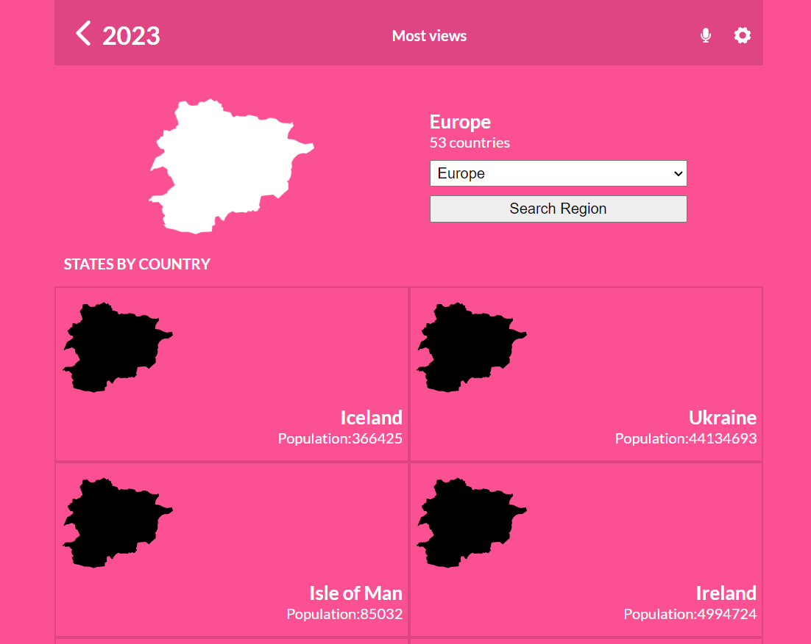
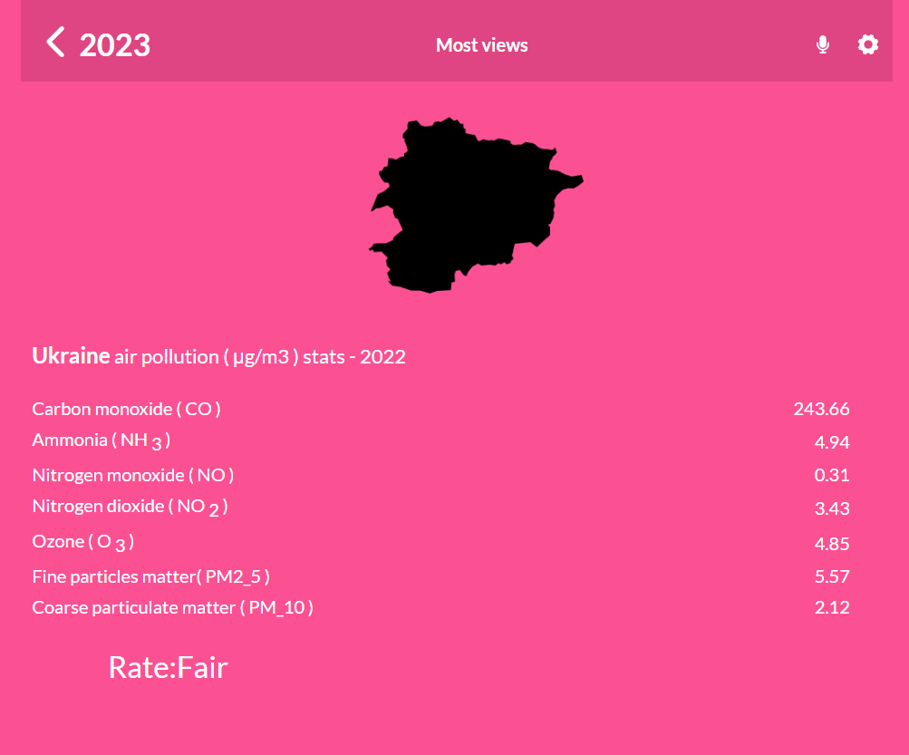

 
  <h3><b>Air Pollution Data</b></h3>

# 📗 Table of Contents

- [📖 About the Project](#about-project)
  - [🛠 Built With](#built-with)
    - [Tech Stack](#tech-stack)
    - [Key Features](#key-features)
  - [🚀 Live Demo](#live-demo)
- [💻 Getting Started](#getting-started)
  - [Setup](#setup)
  - [Prerequisites](#prerequisites)
  - [Install](#install)
  - [Usage](#usage)
  - [Run tests](#run-tests)
  - [Deployment](#triangular_flag_on_post-deployment)
- [👥 Authors](#authors)
- [🔭 Future Features](#future-features)
- [🤝 Contributing](#contributing)
- [⭐️ Show your support](#support)
- [🙏 Acknowledgements](#acknowledgements)
- [❓ FAQ](#faq)
- [📝 License](#license)

# 📖 [Airbase] 

**[Airbase]** "Air-Pollution-App" This is the capstone project for react module that used for finding current air pollution data using geographical coordinates (latitude, longitude). The application will allow users to:
- Find the country,
- See the current air pollution gases in this country.

## 🛠 Built With 
<a name="built-with"> React </a>
<a name="built-with"> Redux </a>
<a name="built-with"> React Bootstrap</a>
<a name="built-with"> Hooks</a>

### Tech Stack 
<a name="tech-stack">React Redux</a>

  
Client

  <ul>
    <li><a href="https://react.org/">React</a></li>
    <li><a href="https://css.org/">Redux</a></li>
    <li><a href="https://css.org/">React Bootstrap</a></li>
  </ul>

  
Server

  <ul>
    <li>Render</li>
  </ul>

Database

  <ul>
   <li><a href="https://restcountries.com/">Restcountries API</a></li>
   <li><a href="https://openweathermap.org/api/air-pollution">OpenWeatherMap API</a></li>
  </ul>

### Key Features 

- **[Show-Countries-per-continenet]**
- **[Show-pollution-Rate]**
- **[show-gas-combination]**

(<a href="#readme-top">back to top</a>)

## Screenshots

## Countries_View

## Pollution_View

## 🚀 Live Demo 

- [Live Demo Link](https://airbase.onrender.com/)

## Demonstration Video
- [Demo-Video]()

(<a href="#readme-top">back to top</a>)

## 💻 Getting Started 

- This project was bootstrapped with Create React App.
- Clone this repo to your local machine 
- cd into the folder and run npm install to install all the dependencies.
- Run npm start to start the app.
- Open http://localhost:3000 to view it in the browser.
- The page will reload if you make edits.
- You will also see any lint errors in the console.
- Run npm run build to build the app for production to the build folder.
- It correctly bundles React in production mode and optimizes the build for the best performance.
- The build is minified and the filenames include the hashes.
- Your app is ready to be deployed!

### Prerequisites

In order to run this project you need:

- Have visual studio Code in your PC.
- Have a verified GitHub account.
- A code editor
- Nodejs
- NPM
- Have a stable browser version.

### Setup

- Create a local directory where you can clone the project.
- Clone this repository to your desired folder using terminal: 
git clone  https://github.com/Rifat8080/airbase.git
- Install the dependencies
- Open the project on a browser

### Install

Install this project with:

- Just run npm i to install all dependencies

### Usage

To run the project, execute the following command:

- npm run build
- npm run start

### Run tests

To run tests, run the following command:

Follow this Link instructions: https://create-react-app.dev/docs/running-tests/

### Deployment

You can deploy this project using:

Render 

(<a href="#readme-top">back to top</a>)

## 👥 Authors 

👤 **Md Mahadi Hasan Rifat**

- GitHub: [@github](https://github.com/Rifat8080)
- LinkedIn: [LinkedIn](https://www.linkedin.com/in/mdmahadihasanrifat/)

(<a href="#readme-top">back to top</a>)

## 🔭 Future Features 

- [ ] **[Better_design]**
- [ ] **[Add_map_foreach_country]**

(<a href="#readme-top">back to top</a>)

## 🤝 Contributing 

Contributions, issues, and feature requests are welcome!

Feel free to check the [issues page](https://github.com/Rifat8080/airbase/issues).

(<a href="#readme-top">back to top</a>)

## ⭐️ Show your support 

If you like this project please star the project and feel free to add your own touches.

(<a href="#readme-top">back to top</a>)

## 🙏 Acknowledgments 

I would like to thank microverse for the great resources shared. Also I would like to thanks Nelson Sakwa for Original Design Official Behance Page @NelsonSakwa, Api - Open Weather

(<a href="#readme-top">back to top</a>)

## ❓ FAQ 

- **[How_to_use_the_app?]**

  - [I puted a small div in the top explaining how to use tha application]

- **[Can_I_Contribute?]**

  - [Sure, you're free to contribute and add your own touches]

(<a href="#readme-top">back to top</a>)

## 📝 License 

This project is [MIT](./LICENSE) licensed.

(<a href="#readme-top">back to top</a>)

